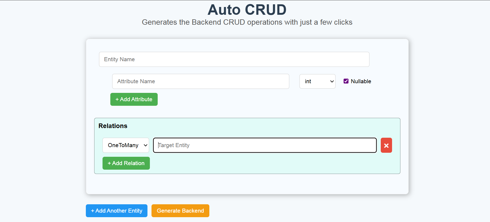
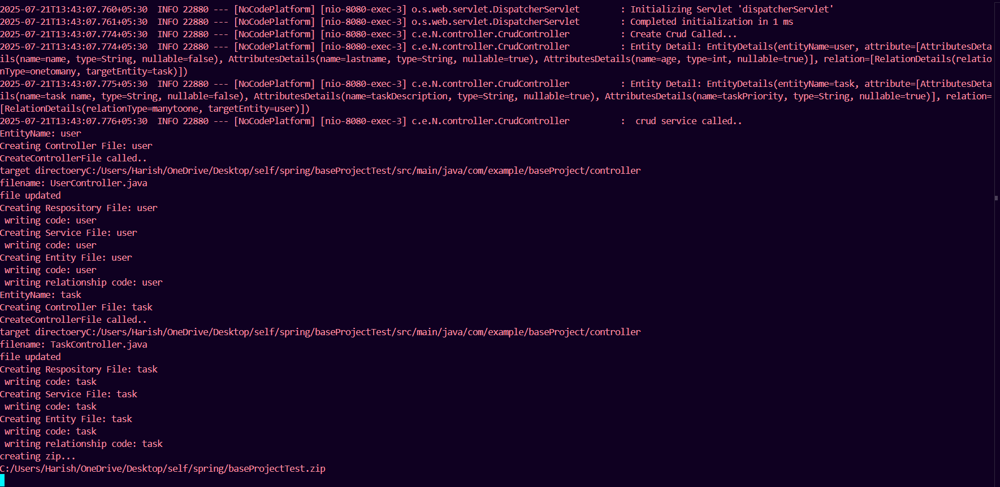

#  AutoCRUD : no-code SpringBoot CRUD generator 
<h3 align="center">No LLM, Just Pure Java</h3>

A backend code generation platform that lets you build complete Spring Boot CRUD modules, including Entity, Repository, Service, and Controller by simply providing input through a REST API or UI. It now supports **multiple entities**, **entity relationships** (`One-to-Many`, `Many-to-One`), **basic field validation**, and **automatic .zip project downloads**. Without any LLM models just pure Java Programming

---

##  Features

-  REST + UI-based input for entity and attributes  
-  Auto-generates:
  - Entity classes with annotations
  - JPA Repositories
  - Service classes
  - REST Controllers  
-  Relationship support:
  - `@OneToMany`, `@ManyToOne`
-  Automatic handling of infinite recursion with `@JsonIgnore`
-  Support for **basic validations** like `@NotNull`, `@Size` *(configurable via JSON)*
-  Dynamic file writing to target project (`baseProjectTest`)
-  Backend generates and auto-zips project files
-  Frontend auto-downloads the `.zip` file after generation
-  UI available for simple entity input
-  JSON-based API for automation via Postman

---

<h2 align="center">AutoCRUD</h2>
<p align="center">
    
</p>

---

##  Tech Stack

| Layer      | Tech                         |
|------------|------------------------------|
| Backend    | Spring Boot, Java 17         |
| Frontend   | React                        |
| API Client | Postman                      |
| Build Tool | Maven                        |

---

##  Download Behavior

Upon entity submission via UI or API:
- Backend generates the full CRUD module
- A `.zip` is created with all source files
- File is automatically downloaded in the frontend
- If generation fails, an appropriate error is shown

---

##  Sample JSON Input (via API)

```json
[
  {
    "entityName": "user",
    "attribute": [
      { "name": "name", "type": "String", "nullable": false },
      { "name": "lastname", "type": "String", "nullable": true },
      { "name": "age", "type": "int", "nullable": true }
    ],
    "relation": [
      {
        "relationType": "onetomany",
        "targetEntity": "task"
      }
    ]
  },
  {
    "entityName": "task",
    "attribute": [
      { "name": "task name", "type": "String", "nullable": false },
      { "name": "taskDescription", "type": "String", "nullable": true },
      { "name": "taskPriority", "type": "String", "nullable": true }
    ],
    "relation": [
      {
        "relationType": "manytoone",
        "targetEntity": "user"
      }
    ]
  }
]
```

---
<h2 align="center">Backend Code Genaration (terminal)</h2>
<p align="center">
    
</p>

---
## 🔍 How It Works (*No AI,*  Just Pure Java)

Unlike AI-based code generators, **this platform does not use any Large Language Models (LLMs)** like ChatGPT, Codex, or any code-generation AI.  
Instead, it relies entirely on **traditional Java programming** to:

- Parse JSON input for entities and relationships
- Dynamically generate Java class files with accurate syntax and annotations
- Uses **string manipulation and builders** to construct valid Java class definitions (e.g., Entity, Repository, Service, Controller).
- Automatically adds appropriate annotations such as `@Entity`, `@Id`, `@GeneratedValue`, `@ManyToOne`, `@OneToMany`, and more.
- Generates CRUD endpoints with proper REST mappings (`@PostMapping`, `@GetMapping`, etc.).
- Handles entity relationships including **One-to-Many** and **Many-to-One** based on user-defined input.
- Manage file and folder generation within the backend
- Package the output into a downloadable `.zip` file

✅ **100% pure Java coded generation logic — No AI or LLMs involved**
